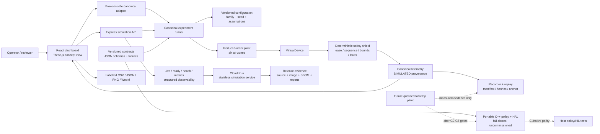

# ColdFlow architecture

ColdFlow is a simulation-first demonstrator. The public application runs a deterministic, versioned virtual device; it does not connect to compressors, refrigeration controls, mains power, food product, or physical actuators.

## System view

## Runtime flow

1. The user chooses a scenario, configuration family, comparator, and source context in the dashboard.
2. The browser-safe adapter selects a versioned configuration manifest and deterministic seed.
3. The canonical runner advances the reduced-order plant through the `VirtualDevice`.
4. The virtual device applies leases, sequence checks, freshness checks, context checks, bounds, and fault handling before producing a result.
5. The UI displays the result with `SIMULATED` provenance, configuration/manifest/output/replay hashes, and an explicit safety state.
6. Record/replay tooling can regenerate the same virtual-device result from the canonical schedule and retained local anchor.
7. The public API and Cloud Run service remain stateless; no physical command route exists.

## Main modules

| Layer | Current implementation | Boundary |
| --- | --- | --- |
| Experience | `src/Dashboard.tsx`, `src/Chamber.tsx`, `src/dashboard.css` | Interactive concept UI; not physical telemetry or CFD |
| Public adapter | `src/simulator/public-experiment.ts` | Browser-safe canonical experiment path |
| API | `server/app.mjs`, `server/index.mjs` | Simulation and explanation routes only |
| Plant | `src/simulator/plant.ts`, `src/simulator/configurations/` | Reduced-order synthetic air-temperature model |
| Virtual device | `src/simulator/virtual-device.ts` | Host simulation of device boundaries and safe outputs |
| Contracts | `src/contracts.ts`, `contracts/` | Versioned evidence, labels, schemas, and fixtures |
| Evidence | `recorder/`, `analysis/`, `ml/` | Synthetic/replay evidence; no physical ground truth |
| Firmware boundary | `firmware/include/`, `firmware/src/`, `firmware/tests/` | Portable fail-closed policy/HAL scaffold; pins disabled |
| Operations | `server/observability.mjs`, `deploy/`, `scripts/` | Production-shaped simulation operations; not fleet operations |

## Safety authority

The deterministic safety policy is the only component allowed to authorize a bounded simulated output. The advisory model can classify or explain a result, but it cannot write an actuator command. The future physical system must preserve the same boundary: ColdFlow may be limited to added secondary airflow, while the OEM refrigeration controller and independent hardwired safety remain authoritative.

## Evidence boundary

`SIMULATED` and `REPLAY` records are reproducible software evidence. They do not establish actuator authority, sensor calibration, product-core behavior, food quality, energy savings, field efficacy, safety certification, customer acceptance, or completion of G0-G6. The proposed hardware path is intentionally shown as a future qualified activity, not as an implemented subsystem.

## Release evidence chain

A reviewed release binds the source commit, package-lock hash, test results, evaluation report, model decision, replay manifest/anchor, SBOM/license result, immutable container digest, Cloud Run revision, and live route checks. Generated evidence belongs under ignored `artifacts/`; public documentation should contain only reviewed summaries and simulation-labelled media.
